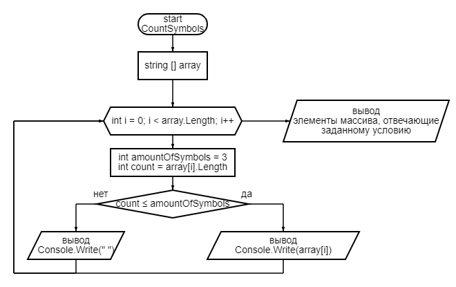

**Графический алгоритм основного метода решения задачи**

**Создаем массив**

Для создания массива, включающего в себя элементы с неопределенным заранее
количеством символов, воспользуемся методом "*CreateArray*" с переменной "*length*",
которая будет задавать длину массива.

С помощью цикла "*for*" задаем для элементов ввод с клавиатуры.
В результате выполнения заданного метода получаем массив "*array*" с заданным количеством элементов.

**Отображаем массив**

Для отображения получившегося массива "*array*" воспользуемся методом "*ShowArray*", который выводит в одну строку консоли элементы, введенные пользователем.

**Выбираем элементы массива, состоящие из трех и менее символов**

Для вывода элементов массива "*array*", отвечающих заданному в условии требованию, воспользуемся методом "*CountSymbols*". 
Данный метод основывается на цикле "*for*", выполняющем проверку соответствия каждого элемента заданному условию.
При выполнении условия отображаем соответствующие элементы.

**Собираем программу из методов**

В порядке применения указываем выполняемые методы и команды. В результате получаем решение заданной задачи.

